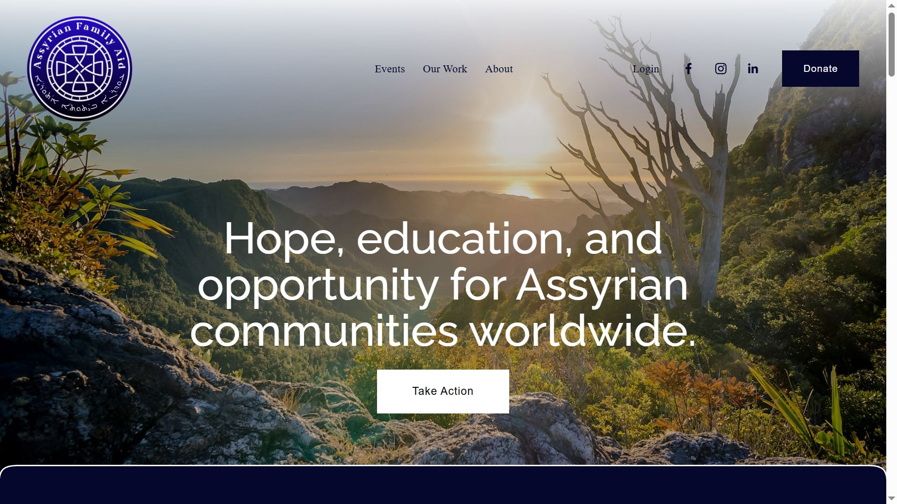
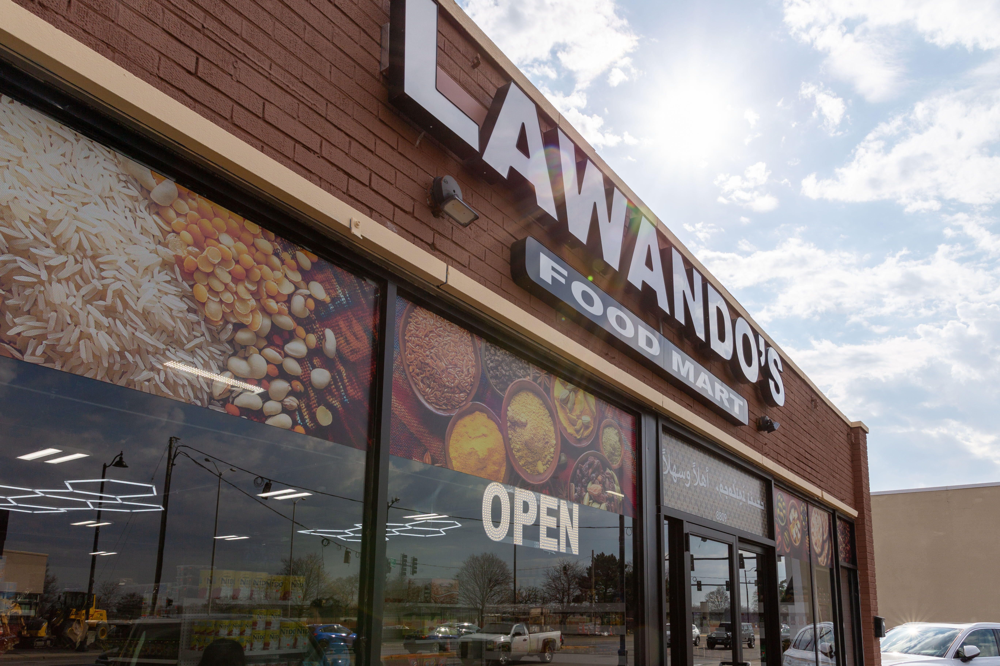

# Data Analyst
## View My
- Linkedin: [https://www.linkedin.com/in/elena-lawando/](https://www.linkedin.com/in/elena-lawando/)
- Tableau: [https://public.tableau.com/app/profile/elena.law/vizzes](https://public.tableau.com/app/profile/elena.law/vizzes)
- Github: [https://github.com/elaw12](https://github.com/elaw12)
  
#### Technical Skills : R, SQL, Tableau, Python, Excel, C++

## Education
- B.S., Biochemistry | North Park University (_May 2020_)
- Google Data Analytics | coursera.org (_April 2024_)

## Projects
### Assyrian Family Aid Website

As a volunteer, I designed and developed the official website for Assyrian Family Aid, a nonprofit supporting Assyrian communities. I handled the full web build, domain linking, and SEO optimization to help the organization establish a strong digital presence and reach more supporters. The site serves as a central hub for sharing their mission, accepting donations, and promoting ongoing projects.
- Visit the Website at [https://www.assyrianfamilyaid.org/](https://www.assyrianfamilyaid.org/)

### Lawando's Food Mart Inventory

Led a point-of-sale inventory setup for Lawando’s Food Mart, a Middle Eastern grocery store. Using Excel, Python, and Power Query, I compiled, cleaned, and organized product data from multiple vendors to build a clean and functional inventory database. I also analyzed market data to determine competitive pricing for over 3,000 inventory items. This project supported the store’s launch and helped streamline ongoing operations through automation and structured data management.

### Case Study: Chicago Food Inspections Analysis 

This case study is an analysis on the city of Chicago's food inspections public data. Additionally, the data can be searched through using the Tableau interactive dashboard linked below.
- [Data Analysis Files](https://github.com/elaw12/Chicago-Food-Inspections/tree/main?tab=readme-ov-file)
- [Tableau Interactive Dashboard](https://public.tableau.com/app/profile/elena.law/viz/ChicagoFoodInspectionsDashboard/Dashboard4)
- [Search through Chicago restaurant inspections here](https://public.tableau.com/app/profile/elena.law/viz/ChicagoFoodInspectionsSearchChart/ChicagoFoodInspectionsSearch)

### Case Study: Bellabeat Data Analysis

This case study analyzes usage data from the non-Bellabeat smart device, Fitbit, to gain insights on how consumers use these products. Bellabeat can then utilize these insights to inform a marketing strategy for their products. This case study was preformed as a part of the Google Data Analytics course.  
- [Data Analysis Files](https://github.com/elaw12/BellabeatAnalysis)
- [Tableau Presentation](https://public.tableau.com/app/profile/elena.law/viz/BellabeatDataAnalysis_17247976522460/Story1)
